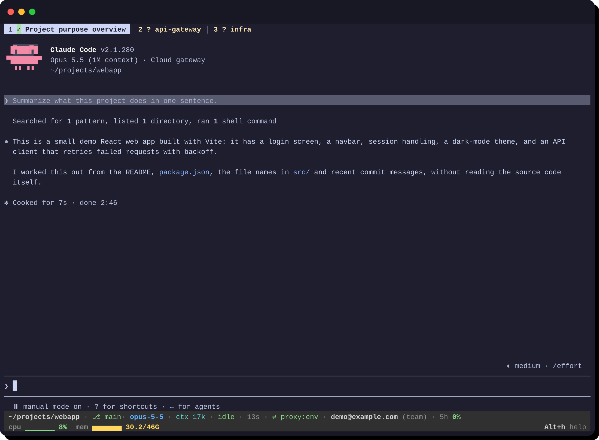
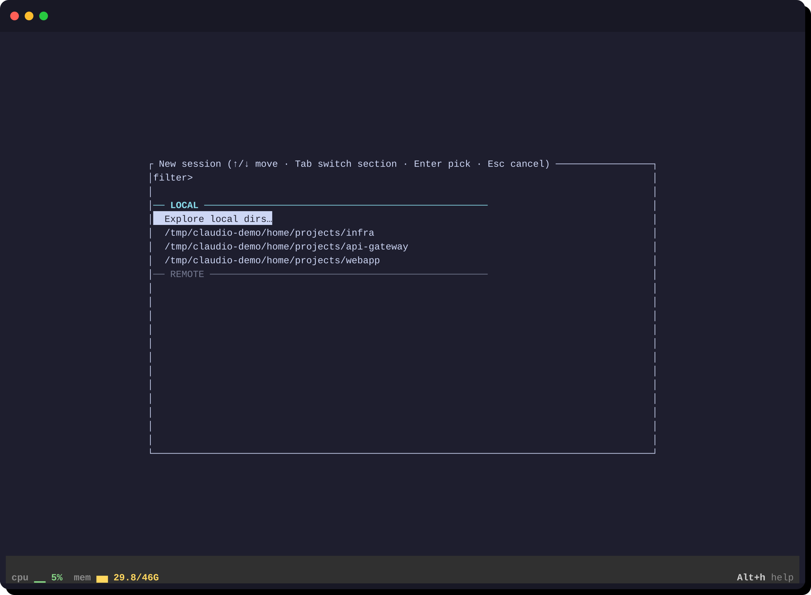
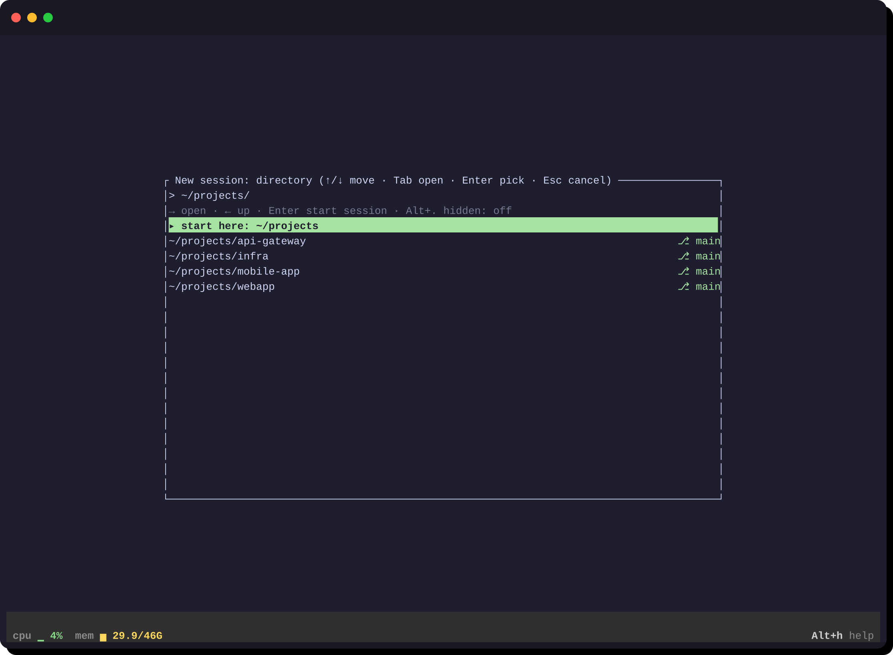
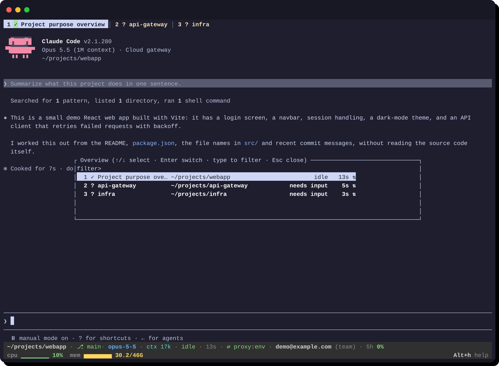
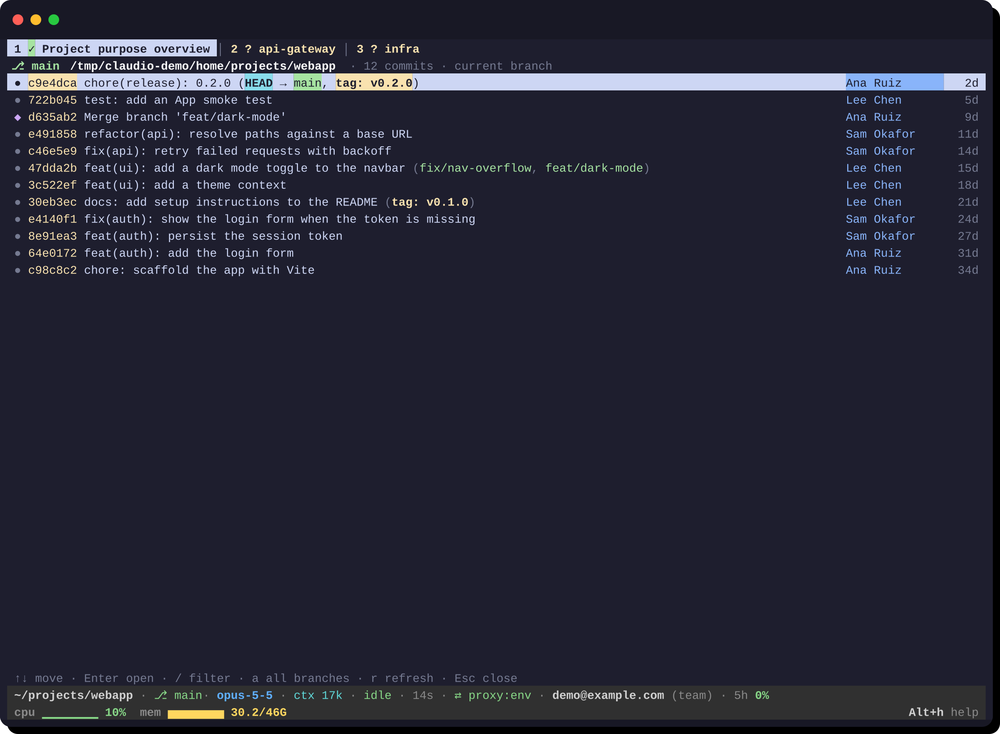
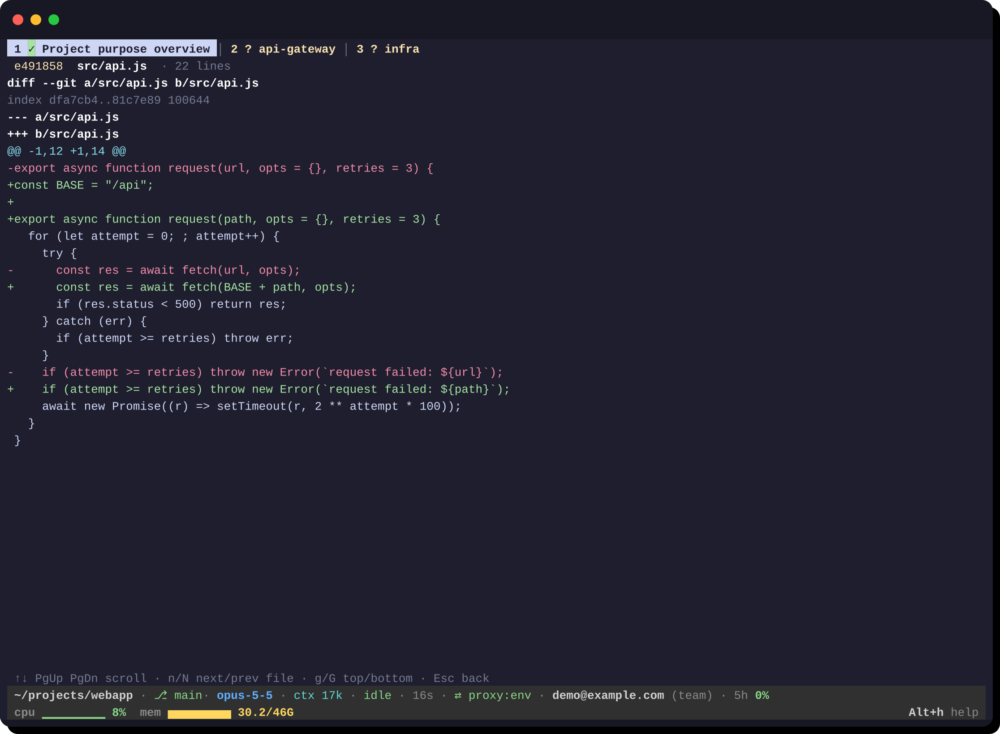
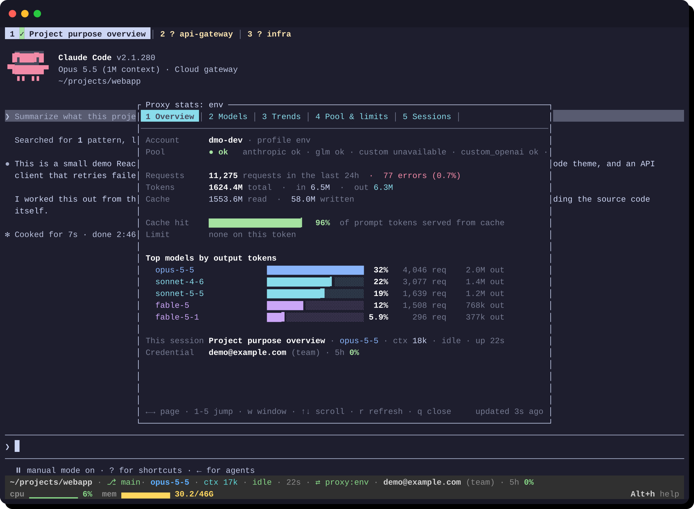
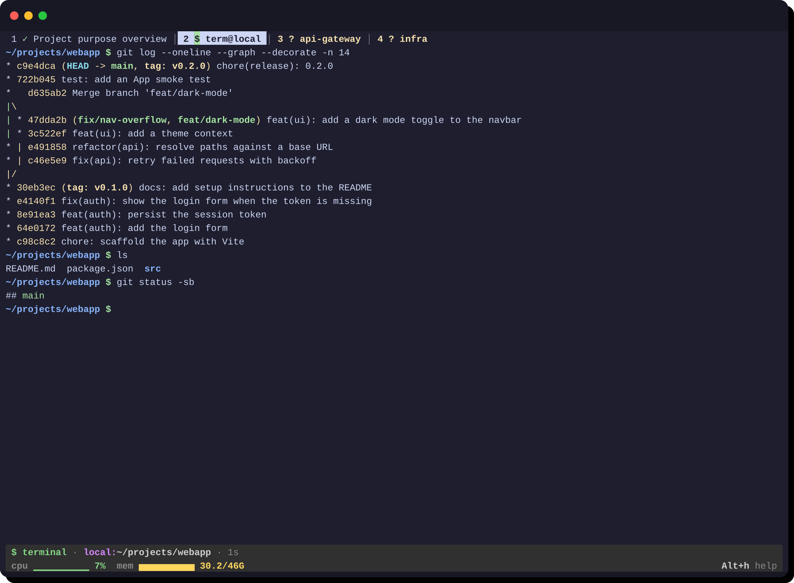

# claudio

A terminal-native session manager for [Claude Code](https://claude.ai/claude-code). Run many Claude Code sessions, local and over SSH, in one terminal window. Sessions survive closing the UI or an SSH drop, and pick up where they left off.

---

## Screenshots

<!-- Regenerate: CLAUDIO_SCREENSHOTS=docs/screenshots cargo test --test screenshots -- --nocapture -->



*The active session with Claude Code running. The tab bar shows every session with a state glyph; amber and red tabs need attention. The two-line status bar shows the session and its host's CPU and memory.*



*The new-session wizard. LOCAL starts with your recent directories; REMOTE lists SSH hosts from `~/.ssh/config`.*



*The directory browser. `▸ start here` starts the session in the directory you are looking at.*



*Alt+g: all sessions at a glance.*



*Alt+l: the git viewer lists the session directory's commits, with branches, tags and merges.*



*Enter on a commit and then on a file shows its colored patch; Esc steps back one page at a time.*



*Alt+s: the proxy stats popup, here on its Overview page (account, pool health, usage, top models, this session's credential).*



*Alt+c opens a `$ term@local` terminal tab right next to the active session, in the same directory.*

---

## Install

```bash
curl -fsSL https://github.com/p4u/claudio/releases/latest/download/install.sh | bash
```

**Options** (environment variables before the command):

| Variable | Default | Description |
|---|---|---|
| `CLAUDIO_VERSION` | latest | Pinned release tag, e.g. `v0.3.0` |
| `CLAUDIO_INSTALL_DIR` | `~/.local/bin` | Where to place the `claudio` binary |

**From source:** `make install` builds a static binary, installs it, and restarts a running daemon.

**Platforms:** Linux and macOS, x86\_64 and arm64.

---

## Quick start

### Without a proxy

**Requirements:** [Claude Code](https://claude.ai/claude-code) installed and logged in (`claude` works in your shell), and `~/.local/bin` on your `PATH`.

1. [Install](#install) claudio and run `claudio`.
2. The new-session wizard opens. Pick **Explore local dirs…** to browse from your home directory, one of your recent directories, or an SSH host under *Remote*.
3. Start a new conversation or resume a previous one from that directory.
4. Work as usual. Only `Alt` keys are claudio's; everything else goes to Claude Code. `Alt+h` lists them all.
5. Close the UI with `Alt+q` (sessions keep running) and run `claudio` again later: everything is where you left it.

**SSH:** pick a host under *Remote* (key-based `ssh <host>` must work without a password). claudio installs itself on the remote, and those sessions survive disconnects too.

### With claude-proxy

[claude-proxy](https://github.com/p4u/claude-proxy) is a multi-subscription credential proxy for Claude Code: sessions authenticate through it instead of a local `claude` login.

```bash
claudio proxy login https://proxy.example.com   # prompts for your token; it is never an argument
claudio                                         # new sessions now use the proxy by default
```

- `claudio --no-proxy` or `claudio --proxy <profile>` overrides the default for one run.
- `CLAUDIO_PROXY_URL=<token>@proxy.example.com claudio` uses a proxy for one run without saving a profile.
- The status bar shows which upstream credential the session is running on, and `Alt+s` opens the proxy stats.

### Just one claude, with the proxy (`--plain`)

```bash
claudio --plain [--proxy NAME | --no-proxy] [claude args…]
```

One full-screen claude session with the proxy configured: no tabs, no status bar, no saved state. It feels like plain `claude`, and exits when claude does, with claude's exit status. Only four keys are claudio's: `Alt+h` help, `Alt+s` proxy stats, `Alt+l` git history, `Alt+e` restart. Everything else, and every argument, goes to claude.

### Everyday commands

| Command | What it does |
|---|---|
| `claudio` | Open the session manager |
| `claudio --plain …` | One plain claude session with the proxy configured |
| `claudio sessions` | List sessions as a table (for scripts) |
| `claudio daemon status\|stop\|restart` | Inspect or control the background daemon |
| `claudio proxy login\|status\|use\|logout` | Manage proxy profiles |
| `claudio upgrade [--check]` | Install the latest release, or only check for one |
| `claudio -p "…"` | Drop-in for `claude -p` ([details](docs/print-and-api.md)) |
| `claudio --api` | OpenAI-compatible API server ([details](docs/print-and-api.md)) |

---

## What it does

A per-host background daemon owns the sessions, so they keep running after you close the UI or lose an SSH connection. When the UI comes back every session is restored, and interrupted ones are recovered with `claude --resume`.

### New-session wizard

`Alt+n` opens the wizard (it also opens when there are no sessions).

1. **Start screen.** *Local* has **Explore local dirs…** and your recently used directories, annotated with their git branch (⎇) and last claude activity (✻). *Remote* has your SSH hosts: recently used first, then every `Host` in `~/.ssh/config`. Typing filters both; `Tab` switches between them.
2. **Directory browser.** It opens at the host's home. `▸ start here` starts the session in the directory you are looking at. `→` or `Tab` opens the highlighted folder, `←` or `Backspace` goes up, and `Enter` picks the highlighted row. Typing a path narrows the list; typing anything else fuzzy-searches your recent and project directories. Dot-directories are hidden; `Alt+.` shows them.
3. **New or resume.** If the directory has earlier Claude Code conversations, pick one to resume or start a new one.

`Backspace` on an empty input goes back a step.

### Tabs and attention

Each tab shows the session name and, for remote sessions, the host. Its glyph shows the state:

| Glyph | State | Tab color |
|---|---|---|
| ⠸ (animated) | Working | cyan |
| ◆ | Needs approval | red, bold |
| ? | Needs input | amber, bold |
| ✓ | Idle | — |
| ✗ | Error | red, bold |
| ⇄ (dim) | Reconnecting | — |
| `$` | Terminal tab | green |

Background sessions that need you are colored (never blinking) and send a desktop notification (OSC 9). `Alt+a` jumps to the next one. When claude exits cleanly (`Ctrl+D` twice, or `/exit`), its tab closes by itself.

### Status bar

Line one describes the active session: host and directory, git branch, model, context size, state, uptime, and the proxy, including which upstream credential it is on (`⇄ proxy:work · work-max (max) · 5h 37%`, plus `⇆ switched 3m ago` after a switch). Line two shows CPU and memory sparklines for the session's host, turning yellow above 60% and red above 85%, and `Alt+h help`.

### Terminal tabs (`Alt+c`)

`Alt+c` opens a terminal next to the active tab: your login shell, on the same host (over SSH for remote sessions), in the session's directory. Terminal tabs read `$ term@host`, survive closing the UI, can be renamed, and close when the shell exits. After a daemon restart they come back as a fresh shell in the same directory.

### Git history (`Alt+l`)

`Alt+l` opens a read-only git viewer for the active session's directory, running git on the session's host. It has three pages:

- **Log.** Colored commits with refs, author and age. `/` filters, `a` toggles all branches, `r` refreshes, and more commits load as you scroll.
- **Commit.** The message and a colored diffstat. `Enter` on a file shows its patch; `d` shows the whole commit.
- **Patch.** A colored diff. `n` and `N` jump between files.

`Esc` goes back a page. Merges are shown against their first parent. Git's output is sanitized, and external diff drivers and textconv never run.

### Restart a session (`Alt+e`)

`Alt+e` restarts the active session in its tab. `r` restarts claude and resumes the same conversation, which picks up a claude update or proxy change or unsticks a wedged process. `n` starts a new conversation in the same directory. In a terminal tab it restarts the shell.

### Proxy stats (`Alt+s`)

A multi-page popup for the session's claude-proxy profile:

- **Overview:** requests, tokens, cache hit rate, your limit, top models, and this session's credential.
- **Models:** per-model usage.
- **Trends:** 24h against 7d and 30d.
- **Pool & limits:** provider health, your limit, and the model catalogue.
- **Sessions:** your sessions on this profile.

`←`/`→` or `1`–`5` switch pages, `w` changes the time window, and `r` refreshes.

### Keeping claude up to date

Once a day claudio compares your `claude --version` with the latest release on your update channel, and asks before running `claude update`. When an SSH host connects, its claude is compared with yours. If it is older, claudio offers to update it; if it is missing, claudio offers to install it with the official installer. Either way it asks first. Prompts offer `[y] update`, `[n] not now` and `[s] skip this version`. Running sessions keep their binary; new sessions use the updated one.

claudio also starts claude with `--allow-dangerously-skip-permissions`, so bypass-permissions mode is available with `Shift+Tab` (claude does not start in it). Turn this off with `allow_skip_permissions = false` (see [Configuration](#configuration)).

### Keys

Manager keys use `Alt`, so they don't clash with Claude Code. In terminal tabs they shadow the shell's readline `Alt` keys. Each can be rebound in `config.toml` under `[keys]`.

| Key | Action |
|---|---|
| `Alt+←` / `Alt+→` | Previous / next session |
| `Alt+Shift+1`…`9`, `0` | Go to session 1…9, 10 (terminals with the kitty keyboard protocol; not rebindable) |
| `Alt+n` | New session |
| `Alt+c` | Terminal tab next to this one |
| `Alt+l` | Git history |
| `Alt+e` | Restart this session (resume or new conversation) |
| `Alt+r` | Rename |
| `Alt+x` | Close (asks first) |
| `Alt+a` | Next session that needs attention |
| `Alt+g` | Overview of all sessions |
| `Alt+s` | Proxy stats |
| `Alt+h` | Help |
| `Alt+.` | In the wizard: show or hide dot-directories |
| `Alt+q` | Quit the UI (sessions keep running) |
| `Ctrl+D` twice, `/exit` | Claude Code's own exit: the tab closes |

---

## Remote sessions

SSH hosts come from `~/.config/claudio/hosts.json` (most recently used first) and every `Host` alias in `~/.ssh/config`. claudio copies itself to `~/.local/bin/claudio` on the remote and keeps it in sync by checksum. The remote daemon runs under `systemd-run --user` when available, with `setsid` as a fallback. No remote dotfiles are touched.

Requirements: key or agent SSH authentication (no password prompts), and `claude` on the remote. claudio offers to install `claude` there if it is missing.

---

## Drop-in `-p` and the API server

`claudio -p` is a drop-in for `claude -p` that drives the interactive Claude Code UI and reads the real answer and token usage from the session transcript. `claudio --api` serves an OpenAI-compatible HTTP API on the same backend. See [docs/print-and-api.md](docs/print-and-api.md).

---

## Upgrade

When a newer release exists, the status bar shows `↑ vX.Y.Z`. `claudio upgrade` replaces the binary in place. The check is anonymous, runs at most once a day and never blocks. Disable it with `CLAUDIO_NO_UPDATE_CHECK=1` or `[update] check = false`.

---

## Configuration

`~/.config/claudio/config.toml`, all optional:

```toml
[ui]
notify = true                   # desktop notifications for sessions that need you

[update]
check = true                    # check for new claudio releases

[claude]
allow_skip_permissions = true   # start claude with --allow-dangerously-skip-permissions
update_check = "ask"            # this machine's claude vs its release channel: "ask" | "auto" | "off"
remote_check = "ask"            # SSH hosts' claude vs this machine's: "ask" | "auto" | "off"

[keys]                          # rebind any manager key
new_session = "alt+n"
terminal    = "alt+c"
git_log     = "alt+l"
reset       = "alt+e"
```

`CLAUDIO_NO_UPDATE_CHECK=1` disables both the claudio and the claude release checks.

---

## Maintainer

Bump the version in `Cargo.toml`, tag `vX.Y.Z` and push the tag. The release workflow publishes the binaries to this repo.
