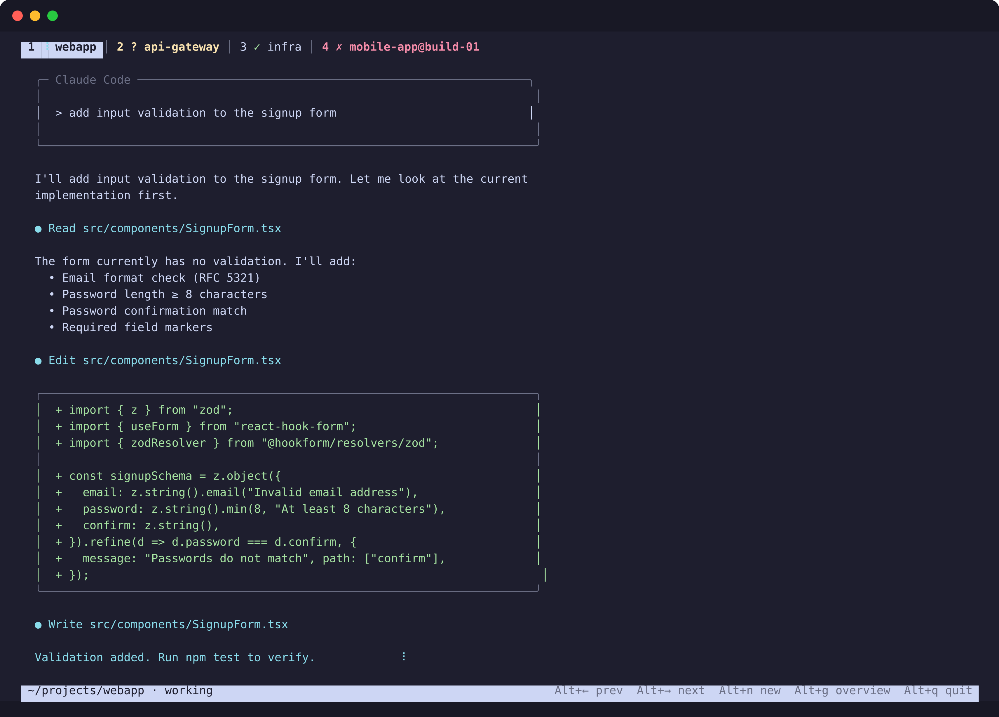
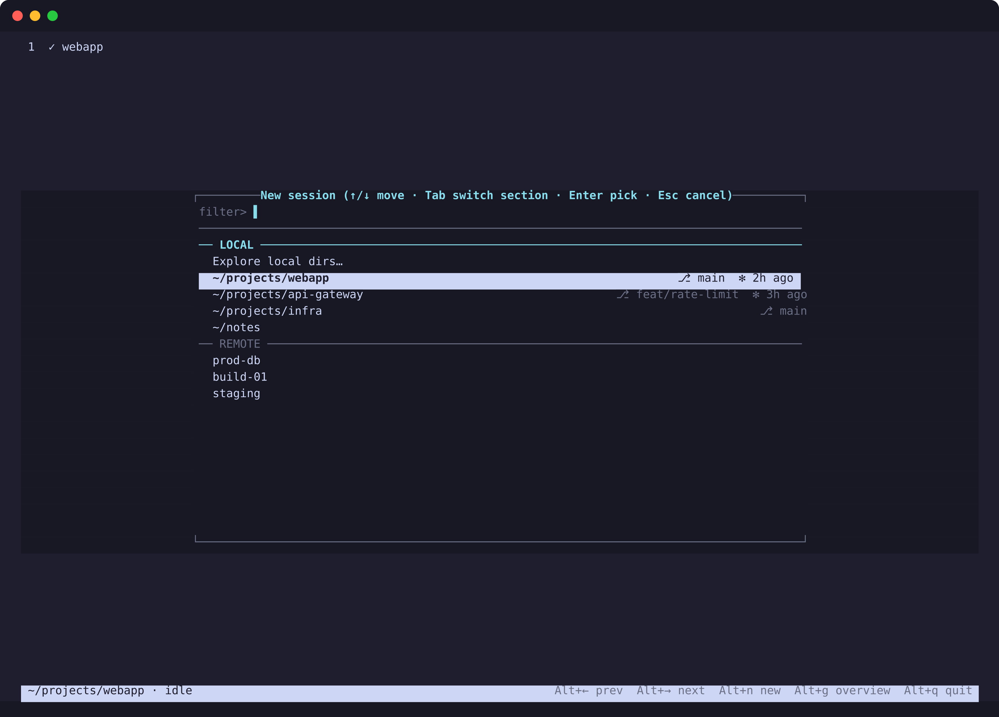
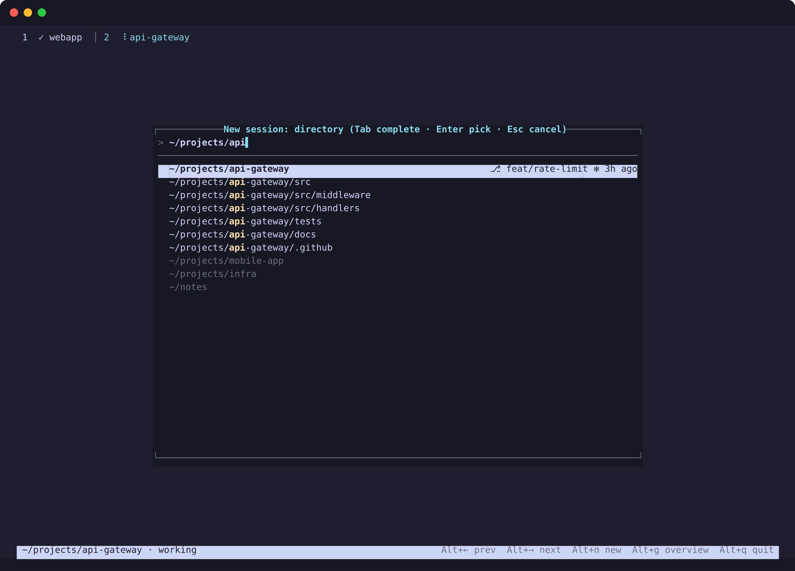
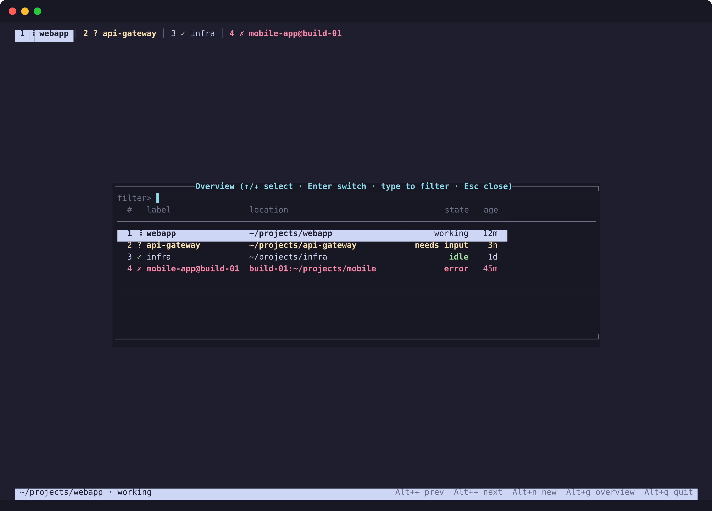

# claudio

A terminal-native session manager for [Claude Code](https://claude.ai/claude-code). Run many Claude Code sessions — local and SSH — in one terminal window. Sessions survive closing the UI or an SSH drop; everything picks up where it left off.

---

## Screenshots



*Active session showing Claude Code output. Tab bar displays all sessions with state glyphs; amber and red tabs flag sessions that need attention.*



*New-session wizard: LOCAL section lists recent directories with git branch (⎇) and claude-activity (✻) badges. REMOTE section lists SSH hosts from `~/.ssh/config`.*



*Directory picker with a live search query. Matching text is highlighted; git and claude-activity metadata appears right-aligned on each row.*



*Alt+g overview: all sessions at a glance, with state, location, and age columns.*

---

## Install

```bash
curl -fsSL https://github.com/p4u/claudio-releases/releases/latest/download/install.sh | bash
```

**Options** (set as environment variables before the command):

| Variable | Default | Description |
|---|---|---|
| `CLAUDIO_VERSION` | latest | Pinned release tag, e.g. `v0.2.0` |
| `CLAUDIO_INSTALL_DIR` | `~/.local/bin` | Where to place the `claudio` binary |

**Platforms:** Linux and macOS, x86\_64 and arm64.

**Requirements:** Claude Code must already be installed. For remote sessions, SSH key/agent authentication to each host.

---

## What it does

Run `claudio` with no arguments to open the session manager. A per-host background daemon owns all PTYs, so sessions keep running after you close the UI or lose an SSH connection. On restart every session is restored, and interrupted ones are recovered automatically with `claude --resume`.

### Keys

All manager keys use `Alt` so they never clash with Claude Code's own bindings. Every binding can be overridden in `~/.config/claudio/config.toml` under `[keys]`.

| Key | Action |
|---|---|
| `Alt+←` / `Alt+→` | Switch between sessions |
| `Alt+n` | New session (opens wizard) |
| `Alt+g` | Overview of all sessions |
| `Alt+a` | Jump to next session needing attention |
| `Alt+r` | Rename session |
| `Alt+x` | Close / kill session |
| `Alt+s` | Proxy stats popup |
| `Alt+h` | Help |
| `Alt+q` | Quit UI (sessions keep running in daemon) |

### Session states

The tab bar shows a glyph for each session:

| Glyph | State | Tab color |
|---|---|---|
| ⠸ (animated) | Working | cyan |
| ◆ | Needs approval | red / bold |
| ? | Needs input | amber / bold |
| ✓ | Idle | — |
| ✗ | Error | red / bold |
| ⇄ (dim) | Reconnecting | — |

Background sessions that need attention (`NeedsInput`, `NeedsApproval`, `Error`) are highlighted in the tab bar and trigger an OSC 9 desktop notification to the outer terminal.

### New-session wizard

Press `Alt+n` (or launch `claudio` with no sessions) to open the wizard:

1. **Start screen** — two sections: LOCAL (an "Explore" entry plus your recently used directories, each annotated with the git branch and last claude-activity timestamp) and REMOTE (SSH host aliases from `~/.ssh/config`). Type to filter both sections at once; Tab switches focus between sections.
2. **Directory picker** — navigate or type a path; Tab-completes. Each entry shows `⎇ branch` and `✻ last-used` badges.
3. **Resume or new** — if the chosen directory has prior Claude Code sessions you can resume one; otherwise a fresh session starts.

### SSH

- Hosts are listed from `~/.config/claudio/hosts.json` (most-recently-used first) followed by every `Host` alias in `~/.ssh/config`.
- The claudio binary is automatically installed on the remote at `~/.local/bin/claudio` and kept in sync by SHA-256 comparison.
- The remote daemon runs under `systemd-run --user` when available (survives `KillUserProcesses`), with `setsid` as fallback.
- No remote dotfiles are modified.

### Upgrade notice

When a newer release is available, the status bar shows `↑ vX.Y.Z` in dim cyan. Run:

```bash
claudio upgrade
```

to download and replace the local binary in place.

---

## claude-proxy

claudio integrates with [claude-proxy](https://github.com/p4u/claude-proxy), an optional self-hosted gateway. After `claudio proxy login <url>`, remote sessions authenticate through the gateway instead of requiring a local `claude` login on each host. The proxy can be configured with a 1M-context model as its default, and `claudio proxy status` shows live pool and token-usage stats.

---

## Drop-in `claude -p` and API server

claudio also works as a drop-in for `claude -p` (pipe / print mode), and with `--api` it exposes an OpenAI-compatible API server backed by your local Claude Code install — any OpenAI client works with it out of the box.

---

## Configuration

`~/.config/claudio/config.toml` — all fields are optional:

```toml
[keys]
prev_session = "alt+left"
next_session = "alt+right"
overview     = "alt+g"
quit         = "alt+q"

[ui]
notify = true   # OSC 9 desktop notifications for attention states
```
